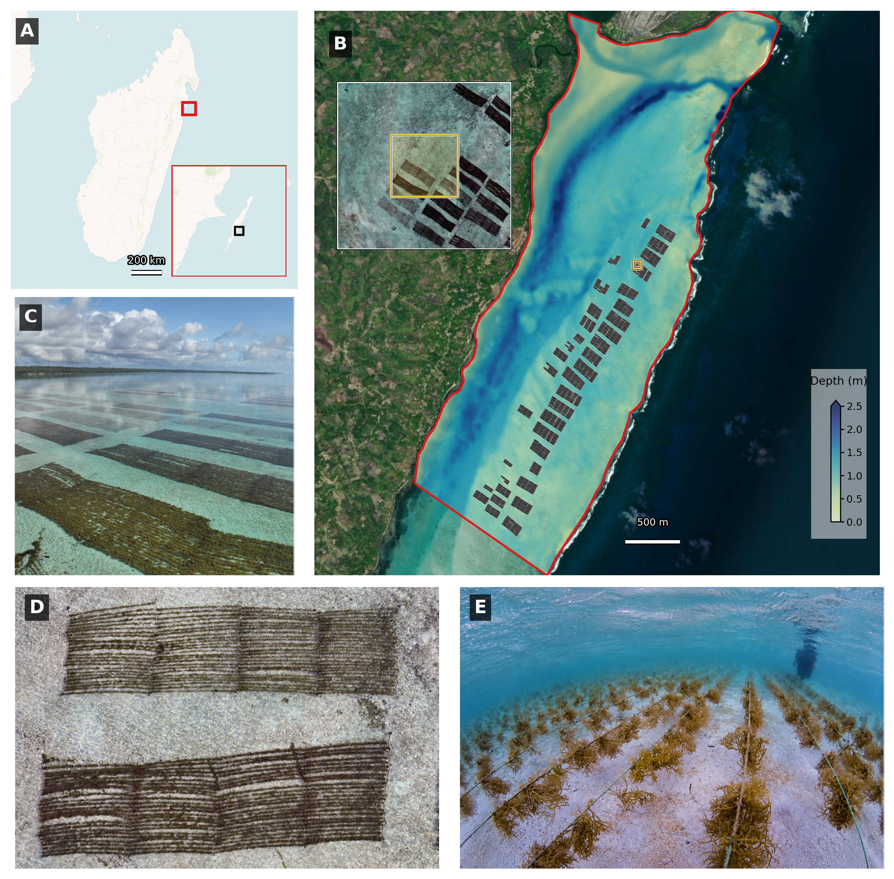
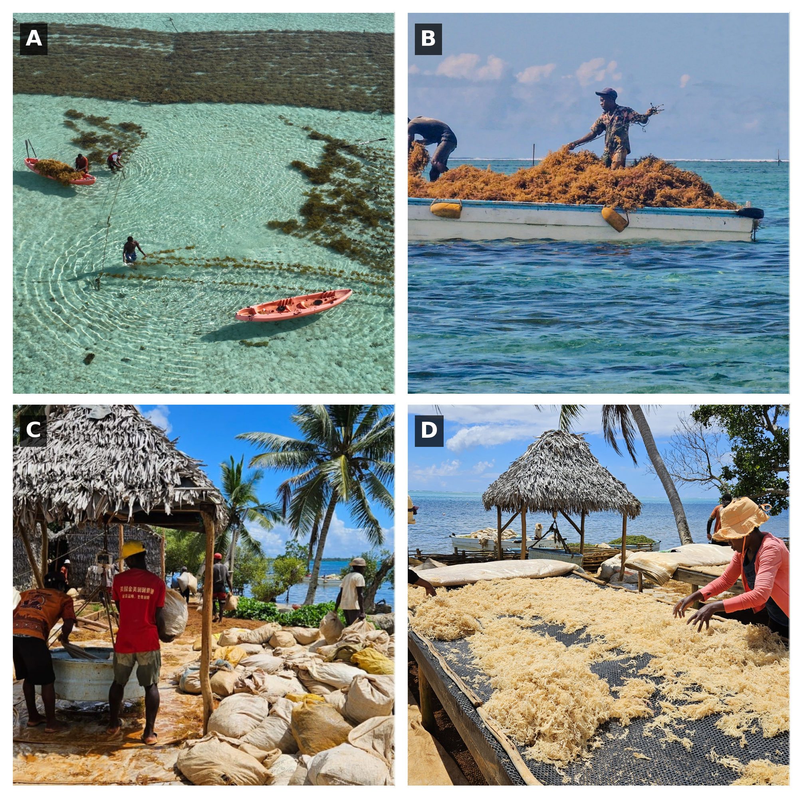
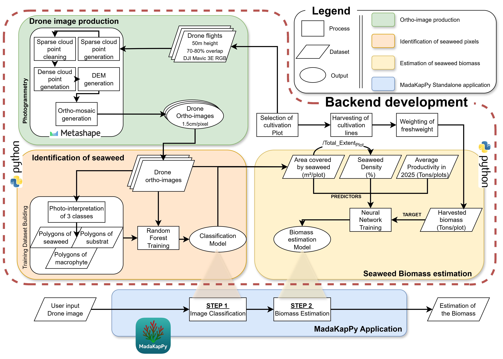
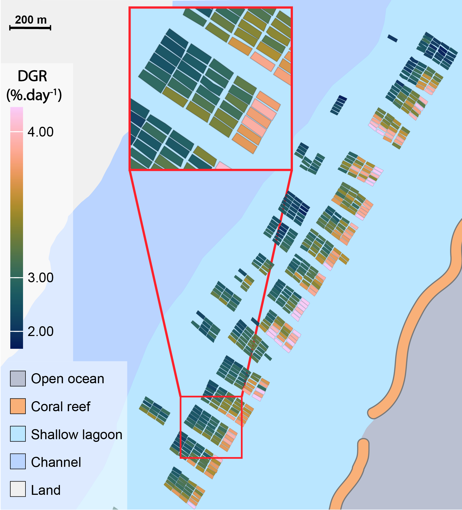
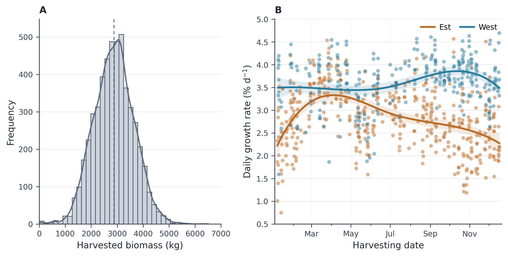
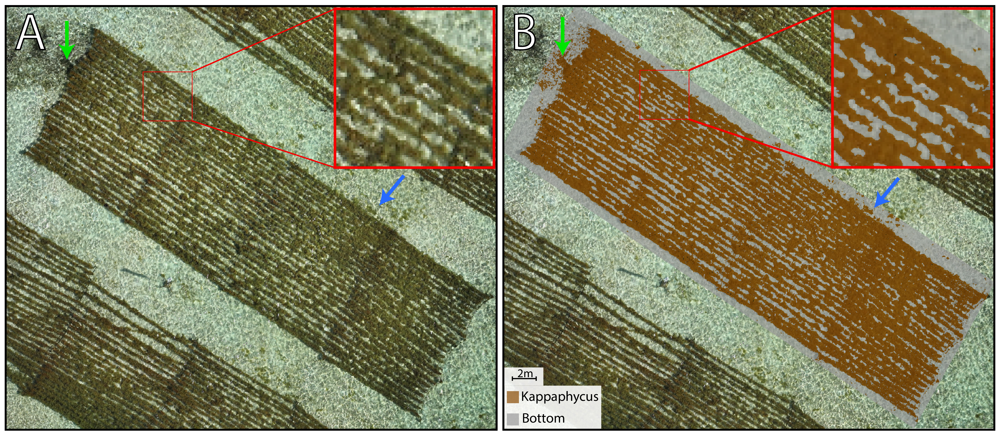

```{r library}
#| echo: false
#| warning: false
#| message: false
#| python.reticulate: false
#| eval: false

library(reticulate)
options(reticulate.conda_binary = "C:/Users/Simon/miniconda3/Scripts/conda.exe")

use_condaenv("MadakapyPaper2026", required = TRUE,
             conda = "C:/Users/Simon/miniconda3/Scripts/conda.exe")
```

# Introduction

In 2022, global production of red macroalgae was estimated at approximately 20.38 million tons [@FAO2024SOFIA]. Within this group, the genera Eucheuma and *Kappaphycus*, collectively referred to as eucheumatoids, are of major economic importance because of their carrageenan content [@Zhang2024Carrageenan]. This high-value hydrocolloid is widely used in the food industry for its gelling, thickening, and stabilising properties [@Hurtado2017TropicalSeaweed]. Although Asia overwhelmingly dominates global production, Eastern Africa has emerged as the principal carrageenophyte-producing region on the African continent, with Zanzibar (Tanzania) and Madagascar as its main production centres [@Hayashi2017Kappaphycus]. In Madagascar, the main cultivated carrageenophytes are *Kappaphycus alvarezii* (commonly known as cottonii; hereafter referred to as *Kappaphycus*), *Kappaphycus striatus*, and *Eucheuma denticulatum*. In 2020, national export volumes reached 17,000 t fresh weight (FW) for *Kappaphycus* and 3,000 t FW for Eucheuma [@msuya2022seaweed]. Since these estimates, production has reportedly increased, largely driven by the expansion of private companies such as Nosy Boraha Seaweed (NBS) and Sovalg in the Sainte-Marie lagoon [@urbina2026mapping]. With an export biomass of 22,000 t FW of *Kappaphycus* in 2025, it is now the leading production area, accounting for 43% of national production (S. Jan, pers. comm.).

In Eastern Africa, the cultivation method uses off-bottom and long-line systems with a relatively short cultivation cycle ranging from 35 to 45 days, which is one of the main reasons for its economic attractiveness to small-scale farmers [@msuya2022seaweed; @urbina2026mapping]. The NBS company, which has developed an innovative community-based aquaculture model, coordinates the management of off-bottom cultivation plots (each plot is 40x12.5 m, with 100 cultivation lines) operated by approximately 120 farmers. Five technicians conduct weekly visual inspections to assess harvest readiness across more than 700 cultivation plots, covering a farming area of nearly 300 ha. At the end of the cultivation cycle, biomass can vary substantially among plots, typically ranging from 2 to 3 tons FW per plot. Given the scale of production, visual errors in plot-level biomass assessment can propagate into substantial uncertainty in total harvest estimates. To address this challenge, the company seeks to optimise harvesting through precision farm-management techniques [@vadassery2024integration]. In this context, drones (Unoccupied Aerial Vehicle, UAV) offer a promising solution, as they can acquire highly detailed data at low altitudes that can be processed with machine-learning algorithms to produce high-precision maps [@Joyce_Fickas_Kalamandeen_2023; @oiry2025mapping].

The use of drones has already been demonstrated as an effective approach for mapping *Kappaphycus* cultivation in regions such as Brazil, Indonesia, and Madagascar [@innocentini2024analysis; @nurdin2025seasionality; @urbina2026mapping]. Their ultra-high spatial resolution, far exceeding that of satellite imagery, together with their operational flexibility for on-demand data acquisition, enables the mapping of areas in ways that satellites cannot achieve [@langford2021monitoring; @setyawidati2017situ]. While drone-based multispectral sensors allow for detailed characterisation of target reflectance and can enhance the discrimination of vegetation types, their use typically involves complex processing workflows, large data volumes, and substantial computational requirements. These constraints limit their accessibility and operational deployment, particularly for non-expert users and private companies seeking simple, robust, and cost-effective monitoring solutions. At very high spatial resolution, RGB imagery can nevertheless provide sufficient information to discriminate targets of interest within complex environments [@roman2026pixels]. In Madagascar, @urbina2026mapping showed that RGB imagery combined with Random Forest classification can accurately discriminate cultivated *Kappaphycus*. However, despite these promising results, there remains a need for simplified, transferable, and operational workflows based on RGB drone imagery that can be readily adopted by non-expert users for routine monitoring of seaweed farming systems.\
\***\*** The objective of this study is to develop an operational drone-based approach for estimating *Kappaphycus* biomass at the cultivation-plot scale prior to harvest. Using RGB imagery acquired during routine farming operations in the Sainte-Marie lagoon (Madagascar), we investigate the capacity of drone-derived information to predict biomass and support precision monitoring. In addition, we aim to translate this approach into a standalone, open-source, user-friendly application directly accessible to aquaculture professionals.

# Materiels & Methods

## Study site

```{r lagoon volume}
#| eval: true
#| echo: false
#| warning: false
#| message: false

library(terra)
library(tidyverse)

mask <- vect("Data/shp/mask_entire_lagoon_32739.shp")

total_volume <- rast("Data/Depth/Depth_S2_20250802.tif")%>%
  mask(mask)%>%
  as_tibble(xy=FALSE)%>%
  rename(depth="Depth_S2_20250802")%>%
  mutate(volume = depth * 10 * 10)%>%
  pull(volume)%>%
  sum()

```

Sainte-Marie (also known as Nosy Boraha) is a small island located off the east coast of Madagascar in the Indian Ocean (@fig-study-area-map A & B). The study area is situated near the village of Ankobahoba, on the eastern side of the island, within a narrow (15 km long × 1.5 km wide) and very shallow lagoon. Water depths generally range from \<1 to 5 m in channels at low tide (@fig-study-area-map C). The lagoon is enclosed by a barrier reef and connected to the open ocean through several reef passes. Its total water volume is approximately `r round(total_volume / 1e6 ,1)` million cubic meters. Substrates are dominated by sand and coral rubble, supporting seagrass meadows, macroalgal beds, and patch reefs, which become increasingly frequent toward the reef front.

Aquaculture represents a major and expanding use of the eastern lagoon, where seaweed farming has become a key component of coastal livelihoods. The activity is dominated by the cultivation of *Kappaphycus alvarezii* (“cottonii”), primarily concentrated in the northern sector of the lagoon. Farming is conducted using off-bottom longline techniques adapted to very shallow environments (@fig-study-area-map D-F). Individual cultivation lines are approximately 10 m long and are arranged in plots comprising 100 lines, forming units of approximately 10 m × 40 m. A farm typically consists of six adjacent plots managed by a single farmer. The Nosy Boraha Seaweed company (NBS) is coordinating the management of 726 cultivation plots in the lagoon. While this activity provides an important alternative source of income amid declining fish stocks, it also contributes to increased spatial competition with traditional fishing practices within this confined coastal system.

More broadly, the lagoon is now included within the newly established AMTP Sorkay (Marine and Terrestrial Protected Area), a large-scale conservation initiative (\~265,000 ha) aimed at preserving the island’s marine biodiversity and promoting sustainable resource management through community-based governance.

```{python}
#| label: make-study-area-map
#| eval: false
#| echo: false
#| warning: false
#| message: false
#| python.reticulate: false

from pathlib import Path

import contextily as cx
import geopandas as gpd
import numpy as np
import matplotlib.patches as mpatches
import matplotlib.patheffects as pe
import matplotlib.pyplot as plt
import matplotlib.ticker as mticker
import rasterio
from rasterio.mask import mask as raster_mask
from rasterio.transform import array_bounds
from rasterio.windows import Window, bounds as window_bounds, from_bounds
from matplotlib.gridspec import GridSpec
from scipy.ndimage import gaussian_filter
from shapely.geometry import box

PROJECT_ROOT = Path.cwd()
STUDY_AREA_CANDIDATES = [
    PROJECT_ROOT / "Data" / "mask_northernmost_lagoon.shp",
    PROJECT_ROOT / "Data" / "shp" / "mask_northernmost_lagoon_32739.shp",
]
STUDY_AREA = next((path for path in STUDY_AREA_CANDIDATES if path.exists()), None)
if STUDY_AREA is None:
    raise FileNotFoundError(
        "Study-area shapefile not found. Checked: "
        + ", ".join(str(path) for path in STUDY_AREA_CANDIDATES)
    )

CADASTER = PROJECT_ROOT / "Data" / "shp" / "Cadaster_NBS_Dec2025.shp"
if not CADASTER.exists():
    raise FileNotFoundError(f"Culture-plot cadaster not found: {CADASTER}")

ZOOM_STUDYSITE = PROJECT_ROOT / "Data" / "shp" / "zoom_studysite.shp"
if not ZOOM_STUDYSITE.exists():
    raise FileNotFoundError(f"Zoom study-site polygon not found: {ZOOM_STUDYSITE}")

DEPTH_CANDIDATES = [
    path
    for folder in (PROJECT_ROOT / "Data" / "depth", PROJECT_ROOT / "Data" / "Depth")
    for path in sorted(folder.glob("*.tif"))
]
DEPTH_RASTER = next(iter(DEPTH_CANDIDATES), None)
if DEPTH_RASTER is None:
    raise FileNotFoundError("No depth raster found in Data/depth or Data/Depth")

DRONE_DIR = PROJECT_ROOT / "Data" / "drone"
DRONE_CANDIDATES = [
    path
    for pattern in ("*.tif", "*.tiff")
    for path in sorted(DRONE_DIR.glob(pattern))
]
DRONE_RASTER = next(iter(DRONE_CANDIDATES), None)
if DRONE_RASTER is None:
    raise FileNotFoundError(f"No drone raster found in {DRONE_DIR}")

PICTURE_DIR = PROJECT_ROOT / "Data" / "Pictures"
PICTURE_NAMES = {
    "D": "DJI_20251205051926_0211_V.jpg",
    "E": "NADIR_plot_cropped.jpg",
    "F": "Kappa2_edited.png",
}
PICTURE_FILES = {label: PICTURE_DIR / name for label, name in PICTURE_NAMES.items()}
missing_pictures = [str(path) for path in PICTURE_FILES.values() if not path.exists()]
if missing_pictures:
    raise FileNotFoundError(
        "Required picture(s) not found: " + ", ".join(missing_pictures)
    )

FIGURE_DIR = PROJECT_ROOT / "Figures"
FIGURE_DIR.mkdir(exist_ok=True)
OUT_FILE = FIGURE_DIR / "study_area.png"

REFERENCE_TILE_SOURCE = cx.providers.CartoDB.VoyagerNoLabels
SATELLITE_TILE_SOURCE = cx.providers.Esri.WorldImagery
DEPTH_SMOOTHING_SIGMA_PIXELS = 1.4


def bbox_wgs84_to_web_mercator(lon_min, lat_min, lon_max, lat_max):
    bbox = gpd.GeoDataFrame(
        geometry=[box(lon_min, lat_min, lon_max, lat_max)],
        crs="EPSG:4326",
    )
    return bbox.to_crs("EPSG:3857").total_bounds


def square_bounds(bounds, pad_fraction=0.12, min_size=None):
    xmin, ymin, xmax, ymax = bounds
    width = xmax - xmin
    height = ymax - ymin
    size = max(width, height) * (1 + 2 * pad_fraction)
    if min_size is not None:
        size = max(size, min_size)
    xmid = (xmin + xmax) / 2
    ymid = (ymin + ymax) / 2
    return [xmid - size / 2, ymid - size / 2, xmid + size / 2, ymid + size / 2]


def transform_bounds(bounds, src_crs, dst_crs):
    bbox = gpd.GeoDataFrame(geometry=[box(*bounds)], crs=src_crs)
    return bbox.to_crs(dst_crs).total_bounds


def add_basemap(ax, extent, zoom, source, crs="EPSG:3857"):
    ax.set_xlim(extent[0], extent[2])
    ax.set_ylim(extent[1], extent[3])
    cx.add_basemap(
        ax,
        source=source,
        crs=crs,
        zoom=zoom,
        attribution=False,
        reset_extent=False,
    )
    ax.set_axis_off()


def add_rgb_raster(ax, raster_path, extent=None, zorder=0):
    with rasterio.open(raster_path) as src:
        raster_extent = [src.bounds.left, src.bounds.bottom, src.bounds.right, src.bounds.top]
        target_extent = raster_extent if extent is None else [
            max(extent[0], raster_extent[0]),
            max(extent[1], raster_extent[1]),
            min(extent[2], raster_extent[2]),
            min(extent[3], raster_extent[3]),
        ]
        if target_extent[0] >= target_extent[2] or target_extent[1] >= target_extent[3]:
            raise ValueError(f"Requested extent is outside raster bounds: {raster_path}")

        window = from_bounds(*target_extent, transform=src.transform)
        window = window.round_offsets().round_lengths()
        window = window.intersection(Window(0, 0, src.width, src.height))
        rgb = src.read([1, 2, 3], window=window)
        image_extent = window_bounds(window, src.transform)

    ax.imshow(
        np.moveaxis(rgb, 0, -1),
        extent=[image_extent[0], image_extent[2], image_extent[1], image_extent[3]],
        origin="upper",
        interpolation="bilinear",
        zorder=zorder,
    )
    ax.set_xlim(target_extent[0], target_extent[2])
    ax.set_ylim(target_extent[1], target_extent[3])
    ax.set_axis_off()


def add_red_box(ax, bounds, linewidth=2.2, color="#e31a1c"):
    xmin, ymin, xmax, ymax = bounds
    ax.add_patch(
        mpatches.Rectangle(
            (xmin, ymin),
            xmax - xmin,
            ymax - ymin,
            fill=False,
            edgecolor=color,
            linewidth=linewidth,
            zorder=8,
        )
    )


def add_panel_label(ax, label, fontsize=13):
    ax.text(
        0.035,
        0.955,
        label,
        transform=ax.transAxes,
        ha="left",
        va="top",
        fontsize=fontsize,
        fontweight="bold",
        color="white",
        bbox={"boxstyle": "square,pad=0.25", "facecolor": "black", "alpha": 0.72, "edgecolor": "none"},
        zorder=10,
    )


def add_panel_border(ax, color="#222222", linewidth=0.7):
    ax.add_patch(
        mpatches.Rectangle(
            (0, 0),
            1,
            1,
            transform=ax.transAxes,
            fill=False,
            edgecolor=color,
            linewidth=linewidth,
            zorder=30,
        )
    )


def add_scale_bar(
    ax,
    length_m,
    label,
    x_fraction=0.58,
    y_fraction=0.06,
    fontsize=7,
):
    xlim = ax.get_xlim()
    ylim = ax.get_ylim()
    xspan = xlim[1] - xlim[0]
    yspan = ylim[1] - ylim[0]
    x0 = xlim[0] + x_fraction * xspan
    y0 = ylim[0] + y_fraction * yspan
    x1 = x0 + length_m
    outline = [pe.Stroke(linewidth=4, foreground="black"), pe.Normal()]

    ax.plot(
        [x0, x1],
        [y0, y0],
        color="white",
        linewidth=2.4,
        solid_capstyle="butt",
        path_effects=outline,
        zorder=10,
    )
    ax.text(
        (x0 + x1) / 2,
        y0 + yspan * 0.025,
        label,
        ha="center",
        va="bottom",
        fontsize=fontsize,
        color="white",
        path_effects=[pe.Stroke(linewidth=2.0, foreground="black"), pe.Normal()],
        zorder=10,
    )


def center_crop_to_ratio(image, target_ratio):
    height, width = image.shape[:2]
    image_ratio = width / height

    if image_ratio > target_ratio:
        crop_width = int(round(height * target_ratio))
        x0 = (width - crop_width) // 2
        return image[:, x0 : x0 + crop_width]

    crop_height = int(round(width / target_ratio))
    y0 = (height - crop_height) // 2
    return image[y0 : y0 + crop_height, :]


def add_photo(ax, path, target_ratio=1.0):
    image = center_crop_to_ratio(plt.imread(path), target_ratio=target_ratio)
    ax.imshow(image)
    ax.set_axis_off()


def load_masked_depth(raster_path, mask_gdf):
    with rasterio.open(raster_path) as src:
        mask_shapes = mask_gdf.to_crs(src.crs).geometry
        depth, transform = raster_mask(src, mask_shapes, crop=True, filled=True)
        data = depth[0].astype("float64")
        if src.nodata is not None:
            data[data == src.nodata] = np.nan
        data[data < -1e20] = np.nan
        bounds = array_bounds(data.shape[0], data.shape[1], transform)
        raster_crs = src.crs
    return data, bounds, raster_crs


def smooth_depth(depth, sigma=DEPTH_SMOOTHING_SIGMA_PIXELS):
    valid = np.isfinite(depth)
    if sigma <= 0 or not np.any(valid):
        return depth

    filled = np.where(valid, depth, 0.0)
    weights = valid.astype("float64")
    smooth_values = gaussian_filter(filled, sigma=sigma, mode="nearest")
    smooth_weights = gaussian_filter(weights, sigma=sigma, mode="nearest")
    smoothed = np.full_like(depth, np.nan, dtype="float64")
    np.divide(
        smooth_values,
        smooth_weights,
        out=smoothed,
        where=smooth_weights > 0.05,
    )
    smoothed[~valid] = np.nan
    return smoothed


def add_bathymetry_overlay(ax, raster_path, mask_gdf):
    depth, depth_bounds, depth_crs = load_masked_depth(raster_path, mask_gdf)
    max_depth = np.ceil(np.nanpercentile(depth, 98) * 2) / 2
    depth = smooth_depth(depth)
    left, bottom, right, top = depth_bounds
    image = ax.imshow(
        depth,
        extent=[left, right, bottom, top],
        origin="upper",
        cmap="YlGnBu",
        vmin=0,
        vmax=max_depth,
        alpha=0.68,
        interpolation="bilinear",
        resample=True,
        zorder=1,
    )
    ax.add_patch(
        mpatches.Rectangle(
            (0.878, 0.065),
            0.098,
            0.30,
            transform=ax.transAxes,
            facecolor="white",
            edgecolor="none",
            alpha=0.50,
            zorder=2,
        )
    )
    cax = ax.inset_axes([0.913, 0.095, 0.017, 0.215])
    cax.set_zorder(20)
    cax.patch.set_alpha(0)
    cbar = plt.colorbar(image, cax=cax, orientation="vertical", extend="max")
    cbar.set_ticks(np.arange(0, max_depth + 0.001, 0.5))
    cbar.ax.yaxis.set_major_formatter(mticker.FormatStrFormatter("%.1f"))
    cbar.ax.tick_params(labelsize=7.2, colors="black", length=2.4, pad=1.8)
    cbar.outline.set_edgecolor("black")
    for tick_label in cbar.ax.get_yticklabels():
        tick_label.set_color("black")
        tick_label.set_fontweight("medium")
    ax.text(
        0.927,
        0.333,
        "Depth (m)",
        transform=ax.transAxes,
        ha="center",
        va="bottom",
        fontsize=8.0,
        color="black",
        fontweight="medium",
        zorder=21,
    )
    return image


study_area_native = gpd.read_file(STUDY_AREA)
study_crs = study_area_native.crs
cadaster_native = gpd.read_file(CADASTER).to_crs(study_crs)
zoom_studysite_native = gpd.read_file(ZOOM_STUDYSITE).to_crs(study_crs)
with rasterio.open(DRONE_RASTER) as src:
    drone_crs = src.crs
zoom_studysite_drone = zoom_studysite_native.to_crs(drone_crs)
study_area_wm = study_area_native.to_crs("EPSG:3857")
study_bounds_native = study_area_native.total_bounds
study_bounds_wm = study_area_wm.total_bounds

madagascar_extent = square_bounds(
    bbox_wgs84_to_web_mercator(44.3, -26.0, 52.8, -11.5),
    pad_fraction=0.0,
)
sainte_marie_extent = square_bounds(
    bbox_wgs84_to_web_mercator(49.60, -17.30, 50.10, -16.60),
    pad_fraction=0.0,
)
study_extent = square_bounds(study_bounds_native, pad_fraction=0.0)
zoom_extent = square_bounds(zoom_studysite_native.total_bounds, pad_fraction=0.8, min_size=150)
zoom_extent_drone = transform_bounds(zoom_extent, study_crs, drone_crs)

sainte_marie_box = square_bounds(sainte_marie_extent, pad_fraction=0.02)
study_area_box = square_bounds(study_bounds_wm, pad_fraction=0.15)

fig = plt.figure(figsize=(9, 9), facecolor="white")
grid = GridSpec(
    2,
    1,
    figure=fig,
    left=0.015,
    right=0.985,
    bottom=0.025,
    top=0.975,
    hspace=0.025,
    height_ratios=[2, 1],
)
top_grid = grid[0].subgridspec(2, 3, wspace=0.025, hspace=0.025)
bottom_grid = grid[1].subgridspec(1, 2, wspace=0.025)

ax_madagascar = fig.add_subplot(top_grid[0, 0])
ax_picture_d = fig.add_subplot(top_grid[1, 0])
ax_study_area = fig.add_subplot(top_grid[:, 1:3])
ax_picture_e = fig.add_subplot(bottom_grid[0, 0])
ax_picture_f = fig.add_subplot(bottom_grid[0, 1])

add_basemap(ax_madagascar, madagascar_extent, zoom=7, source=REFERENCE_TILE_SOURCE)
add_red_box(ax_madagascar, sainte_marie_box, linewidth=2.0)
add_panel_label(ax_madagascar, "A")
add_scale_bar(ax_madagascar, 200_000, "200 km", x_fraction=0.42)
add_panel_border(ax_madagascar, color="#ffffff", linewidth=0.8)

ax_sainte_marie = ax_madagascar.inset_axes([0.56, 0.045, 0.40, 0.40])
add_basemap(ax_sainte_marie, sainte_marie_extent, zoom=11, source=REFERENCE_TILE_SOURCE)
add_red_box(ax_sainte_marie, study_area_box, linewidth=1.6, color="#111111")
ax_sainte_marie.add_patch(
    mpatches.Rectangle(
        (0, 0),
        1,
        1,
        transform=ax_sainte_marie.transAxes,
        fill=False,
        edgecolor="#e31a1c",
        linewidth=1.6,
        zorder=20,
    )
)

add_basemap(
    ax_study_area,
    study_extent,
    zoom=15,
    source=SATELLITE_TILE_SOURCE,
    crs=study_crs,
)
add_bathymetry_overlay(ax_study_area, DEPTH_RASTER, study_area_native)
cadaster_native.plot(
    ax=ax_study_area,
    facecolor=(0.04, 0.04, 0.04, 0.45),
    edgecolor="none",
    linewidth=0.0,
    alpha=1.0,
    zorder=9,
)
cadaster_native.boundary.plot(
    ax=ax_study_area,
    color="white",
    linewidth=0.52,
    alpha=0.95,
    zorder=9.4,
)
cadaster_native.boundary.plot(
    ax=ax_study_area,
    color="#111111",
    linewidth=0.26,
    alpha=1.0,
    zorder=9.5,
)
zoom_studysite_native.plot(
    ax=ax_study_area,
    facecolor=(1.0, 0.84, 0.31, 0.22),
    edgecolor="none",
    zorder=10.5,
)
zoom_studysite_native.boundary.plot(ax=ax_study_area, color="white", linewidth=2.8, zorder=11)
zoom_studysite_native.boundary.plot(ax=ax_study_area, color="black", linewidth=1.9, zorder=11.5)
zoom_studysite_native.boundary.plot(
    ax=ax_study_area,
    color="#ffd54f",
    linewidth=1.15,
    zorder=12,
)
study_area_native.boundary.plot(ax=ax_study_area, color="#e31a1c", linewidth=1.5, zorder=10)
ax_study_area.set_xlim(study_extent[0], study_extent[2])
ax_study_area.set_ylim(study_extent[1], study_extent[3])
ax_study_area.set_aspect("equal", adjustable="box")
ax_study_area.set_axis_off()

ax_zoom_inset = ax_study_area.inset_axes([0.04, 0.57, 0.31, 0.31])
add_rgb_raster(ax_zoom_inset, DRONE_RASTER, extent=zoom_extent_drone)
zoom_studysite_drone.plot(
    ax=ax_zoom_inset,
    facecolor=(1.0, 0.84, 0.31, 0.18),
    edgecolor="none",
    zorder=8,
)
zoom_studysite_drone.boundary.plot(ax=ax_zoom_inset, color="white", linewidth=2.1, zorder=9)
zoom_studysite_drone.boundary.plot(ax=ax_zoom_inset, color="black", linewidth=1.45, zorder=9.5)
zoom_studysite_drone.boundary.plot(
    ax=ax_zoom_inset,
    color="#ffd54f",
    linewidth=1.05,
    zorder=10,
)
ax_zoom_inset.set_xlim(zoom_extent_drone[0], zoom_extent_drone[2])
ax_zoom_inset.set_ylim(zoom_extent_drone[1], zoom_extent_drone[3])
ax_zoom_inset.set_aspect("equal", adjustable="box")
ax_zoom_inset.set_axis_off()
add_panel_border(ax_zoom_inset, color="#ffffff", linewidth=2.2)
add_panel_border(ax_zoom_inset, color="#111111", linewidth=0.9)

add_panel_label(ax_study_area, "B")
add_scale_bar(ax_study_area, 500, "500 m", x_fraction=0.55)
add_panel_border(ax_study_area, color="#ffffff", linewidth=0.8)

add_photo(ax_picture_d, PICTURE_FILES["D"], target_ratio=1.0)
add_panel_label(ax_picture_d, "C")
add_panel_border(ax_picture_d, color="#ffffff", linewidth=0.8)

add_photo(ax_picture_e, PICTURE_FILES["E"], target_ratio=1.5)
add_panel_label(ax_picture_e, "D")
add_panel_border(ax_picture_e, color="#ffffff", linewidth=0.8)

add_photo(ax_picture_f, PICTURE_FILES["F"], target_ratio=1.5)
add_panel_label(ax_picture_f, "E")
add_panel_border(ax_picture_f, color="#ffffff", linewidth=0.8)

fig.savefig(OUT_FILE, dpi=300, bbox_inches="tight", facecolor="white")
plt.close(fig)
```

```{r}
#| label: fig-study-area-map
#| echo: false
#| warning: false
#| message: false
#| fig-cap: "Study area location. (A) Madagascar with Sainte Marie indicated by a red square, and a Sainte Marie Island inset showing the study area with a red square; (B) Northernmost part of the lagoon showing a Sentinel-2 derived depth map (image date: 2025-08-02), culture-plot cadaster of the Nosy Boraha Seaweed company at the 1st of December 2025, study-area boundary, and a drone-image inset on some cultivation plots; (C) Field picture of the study area showing cottonii culture inside of the lagoon; (D) nadir field photograph of two cultivation plots; (E) Underwater view of the off-bottom cultivation lines."
#| out-width: "100%"


```

## Data collection & pre-processing

### Freshweight of harvested seaweed

Between the 1st and the 5th of December 2025, A field campaign was conducted to collect in situ data on the harvested biomass of *Kappaphycus alvarezii* cultures within the study area. The planning of harvesting was established a few days before the harvesting period, allowing to select and identify 126 cultivation plots that will be harvested in the upcoming days. The harvesting process was operated by the farmers of the Nosy Boraha Seaweed Company, following their usual practices. Each plot was harvested by detaching the cultivation lines from the entire cultivation plot (@fig-data-collection A). The harvested lines were then placed on flat boats to be transported to the shore, where all the lines of a single plot were weighted using a standard scale (@fig-data-collection B & C). Therefore, a dataset of the fresh weight of harvested biomass per plot was obtained and used as reference data for the calibration and validation of the algorithm.

```{python}
#| label: make-data-collection-figure
#| echo: false
#| warning: false
#| message: false
#| python.reticulate: false
#| eval: false

from pathlib import Path

import matplotlib.patches as mpatches
import matplotlib.pyplot as plt

PROJECT_ROOT = Path.cwd()
PICTURE_DIR = PROJECT_ROOT / "Data" / "Pictures"
FIGURE_DIR = PROJECT_ROOT / "Figures"
FIGURE_DIR.mkdir(exist_ok=True)
OUT_FILE = FIGURE_DIR / "data_collection.png"

PICTURE_FILES = {
    "A": PICTURE_DIR / "harvesting_guys.jpg",
    "B": PICTURE_DIR / "harvesting_boat.jpg",
    "C": PICTURE_DIR / "harvesting_weight.jpg",
    "D": PICTURE_DIR / "Harvesting_drying.jpg",
}

missing_pictures = [str(path) for path in PICTURE_FILES.values() if not path.exists()]
if missing_pictures:
    raise FileNotFoundError(
        "Required picture(s) not found: " + ", ".join(missing_pictures)
    )


def center_crop_to_ratio(image, target_ratio):
    height, width = image.shape[:2]
    image_ratio = width / height

    if image_ratio > target_ratio:
        crop_width = int(round(height * target_ratio))
        x0 = (width - crop_width) // 2
        return image[:, x0 : x0 + crop_width]

    crop_height = int(round(width / target_ratio))
    y0 = (height - crop_height) // 2
    return image[y0 : y0 + crop_height, :]


def add_panel_label(ax, label, fontsize=13):
    ax.text(
        0.035,
        0.955,
        label,
        transform=ax.transAxes,
        ha="left",
        va="top",
        fontsize=fontsize,
        fontweight="bold",
        color="white",
        bbox={"boxstyle": "square,pad=0.25", "facecolor": "black", "alpha": 0.72, "edgecolor": "none"},
        zorder=10,
    )


def add_panel_border(ax, color="#ffffff", linewidth=0.8):
    ax.add_patch(
        mpatches.Rectangle(
            (0, 0),
            1,
            1,
            transform=ax.transAxes,
            fill=False,
            edgecolor=color,
            linewidth=linewidth,
            zorder=30,
        )
    )


def add_photo(ax, path, target_ratio=1.0):
    image = center_crop_to_ratio(plt.imread(path), target_ratio=target_ratio)
    ax.imshow(image)
    ax.set_axis_off()


fig, axes = plt.subplots(
    2,
    2,
    figsize=(8.4, 8.4),
    facecolor="white",
    gridspec_kw={"wspace": 0.025, "hspace": 0.025},
)

for ax, (label, path) in zip(axes.flat, PICTURE_FILES.items()):
    add_photo(ax, path, target_ratio=1.0)
    add_panel_label(ax, label)
    add_panel_border(ax)

fig.savefig(OUT_FILE, dpi=300, bbox_inches="tight", facecolor="white")
plt.close(fig)
```

```{r}
#| label: fig-data-collection
#| echo: false
#| warning: false
#| message: false
#| fig-cap: "Data collection during harvesting. (A) Harvesters handling culture lines in the lagoon; (B) harvested lines loaded on a flat boat for transport to shore; (C) weighing of harvested biomass on shore; (D) drying of harvested biomass."
#| out-width: "100%"


```

### Drone surveys

Seaweed harvesting in the lagoon is systematically synchronised with low tide, as reduced water levels facilitate access to the cultivation lines. During the survey period (1–5 December 2025), low tides occurred between 04:25 and 07:54 local time, with sunrise around 05:00; water levels were less than 1m during flights. Unmanned aerial vehicle (UAV) surveys were conducted prior to the onset of daily harvesting activities, targeting cultivation plots scheduled for harvest that day (@fig-workflow - Green sector). Early-morning flights were necessary both to coordinate with harvesting operations and to optimise imaging conditions. At this latitude (\~ 16°S), solar elevation increases rapidly after sunrise, enhancing sun glint on the water surface and degrading image quality over the cultivation structures. Conducting flights shortly after sunrise, combined with the use of a polarising filter on the UAV camera, minimised sun glint and enabled the acquisition of high-quality imagery of the cultivation lines. Drone surveys were performed using a DJI Mavic 3 Enterprise, equipped with a 4/3 CMOS sensor and a 24 mm equivalent lens. The UAV was flown at an altitude of 50 m above ground level, resulting in a ground sampling distance of around 1.5 cm. Flight plans were designed to cover the entire area of each targeted cultivation plot with 80% of front overlap and 70% side overlap. Imagery from each flight was processed using a structure-from-motion photogrammetry workflow implemented in Agisoft Metashape (v2.1.1) to generate orthomosaics. The same processing pipeline was consistently applied across all datasets. Initially, tie points were automatically identified both within individual images and across overlapping image pairs to construct a sparse point cloud. This preliminary cloud was subsequently filtered based on reprojection error to eliminate low-quality or noisy points. A dense point cloud was then generated using multi-view stereo reconstruction. From this dense representation, a continuous surface was interpolated to produce a digital surface model (DSM), which served as the geometric basis for orthorectification and the generation of the final orthomosaic.

### Spatial heterogeneity of the algae production

Because the production of seaweed was not homogeneous across the lagoon, being able to identify cultivation plots that are more productive than others can help to better predict the production of each individual plot. The production of each individual plot of the year 2025 was retrieved from the Nosy Boraha seaweed company. The dataset records the total freshweight harvested per plot along the year. Each cultivation plot is associated with a unique identifier, which allowed production records to be matched to their corresponding spatial location using the seaweed-farming cadaster.

## Random Forest classification

Seaweed cultivation lines were identified from drone imagery using a Random Forest classifier. This ensemble learning method, originally introduced by @Breiman2001RandomForests combines multiple decision trees built through bootstrap aggregation (bagging) to improve predictive performance and robustness. Random Forest has been widely applied in ecological remote sensing, including ecosystem mapping and aquaculture monitoring [@Oiry2021MPBWaterQuality; @roman2026pixels; @nurdin2023precision]. The approach relies on supervised classification, where the model is trained using labeled samples to learn relationships between predictor variables and target classes. At each iteration, a decision tree is constructed from a bootstrap sample of the training dataset, while a random subset of predictor variables is considered at each split. This dual randomisation reduces overfitting and allows the model to effectively handle non-linear relationships and collinearity among predictors. Final pixel-wise classification is obtained through majority voting across all trees, whereby each tree contributes a class prediction and the most frequent class is assigned to the pixel.

For model construction, training data were derived at the pixel level from polygons manually assigned to the target classes and overlaid on the drone orthomosaic (@fig-workflow - Orange sector). All valid pixels intersecting each polygon were extracted as individual training samples. Band values were scaled to a common 0-1 range according to image bit depth before model fitting to reduce the effect of brightness changes between flights. Class labels were taken directly from the polygon attribute table. To limit the effect of class imbalance, the number of pixels per class was limited by down-sampling all classes to the size of the least represented class; when applied, sampling was performed without replacement using a fixed random seed. Model tuning was conducted by randomised search over 20 hyperparameter combinations, including the number of trees (200-600), maximum tree depth (10, 20, 30, or unrestricted), minimum number of samples per terminal node (1, 2, or 4). Candidate models were evaluated using stratified cross-validation with up to five folds, with the exact number of folds constrained by the size of the least represented class, and balanced accuracy was used as the optimisation criterion. The final classifier corresponded to the hyperparameter set that produced the highest cross-validated balanced accuracy, and internal model performance was summarised using a cross-validated confusion matrix. The retained Random Forest model comprised 500 trees, a maximum tree depth of 20,and a minimum of four samples per terminal node.

This classification represents the first step of the MadaKapPy workflow, enabling the identification of seaweed pixels used to estimate the area covered within each cultivation plot (@fig-workflow - Blue sector).

### Model building

The training dataset was generated through manual photo-interpretation of drone imagery by three independent operators. Homogeneous areas were delineated and assigned to one of three classes: (i) seaweed cultivation (including both green and brown *kappaphycus* morphotypes), (ii) bottom substrate (comprising bare sediment and coral reef), and (iii) bottom vegetation (macrophytes naturally occurring within the lagoon). This multi-operator approach was adopted to improve the robustness and consistency of the training dataset while reducing potential bias associated with individual operators.

### Model validation

???

## Neural Network, From area to Biomass

Estimating in situ seaweed biomass from drone imagery cannot rely on a simple univariate relationship. First, the relationship between surface area and biomass is inherently non-linear, as biomass scales with volume rather than area. Second, for a given surface coverage, variations in vertical growth (i.e., canopy thickness) can lead to substantial differences in biomass while remaining indistinguishable in nadir imagery. Third, biomass production may vary independently of areal extent due to factors nutrient availability or hydrodynamic.

To account for these sources of variability, a multivariate modeling approach was adopted based on a neural network framework (@fig-workflow - Yellow sector). Biomass was estimated as a function of several complementary predictors:

$$Estimated_{Biomass} = f(Area_{Seaweed}, Density_{Plot}, Average_{Production} )$$

$Estimated_{Biomass}$ was predicted using a plot-level feed-forward neural network trained from harvest records and drone-derived descriptors. The training dataset was assembled by matching observed harvest biomass to cultivation plots using farm and module identifiers. For each plot, the area occupied by *Kappaphycus* classes ($Area_{Seaweed}$) was calculated from the classified imagery. Percent cover ($Density_{Plot}$) was then derived as the proportion of the cultivation plot area occupied by these classes. To represent plot-specific production history, daily growth was calculated from harvested weight after normalisation by culture duration and number of cultivation lines; these values were then summarised for each plot by their average ($Average_{Production}$).

Observed biomass was log-transformed before model fitting to reduce skewness and stabilise variance, and all predictors were standardized using the mean and standard deviation of the training set. The network consisted of an input layer followed by two fully connected hidden layers with 32 and 16 units, respectively, using rectified linear unit activation functions, with a dropout layer (rate = 0.2) inserted between the hidden layers. Model training used the Adam optimiser (learning rate = 0.001) and mean squared error loss for 3000 epochs with a batch size of 16 and no shuffling of the training data. Predictions were subsequently back-transformed by exponentiation to return biomass estimates on the original scale.

```{r}
#| label: fig-workflow
#| echo: false
#| warning: false
#| message: false
#| fig-cap: "Schematic representation of the workflow implemented for the development of the MadaKapPy application. The processes enclosed within the red dashed outline correspond to the backend development pipeline, including drone image production, seaweed identification model training, and biomass estimation model training. End users interact exclusively with the standalone MadaKapPy application, which integrates the trained classification and biomass estimation models into a user-friendly workflow."
#| out-width: "100%"


```

## MadaKapPy standalone application

The full workflow was implemented in a standalone desktop application developed in Python to enable routine use without command-line interaction (@fig-workflow - Blue sector). The application provides a graphical user interface built with Flet and was packaged as a self-contained Windows executable together with the required Python dependencies, geospatial libraries, trained classification and biomass models, scaler files, and auxiliary lookup tables. Within the interface, users specify the input orthomosaic, area-of-interest shapefile, model directory, and output location, after which Random Forest classification and biomass estimation are executed sequentially through a single workflow. To support operational use, the application includes automated management of resource paths, progress reporting during computation, preview maps for visual inspection of classification outputs, and run-history logging to retain model settings and output file locations. This implementation was intended to make the processing chain reproducible and accessible to end users while preserving the underlying analytical workflow described above.

# Results

## Spatio-temporal variability of seaweed production

Across the lagoon, the daily growth rate (DGR) of cultivation plots displayed a marked spatial structure (@fig-plot-productivity-map). Higher mean DGR values were generally observed in plots located along the eastern side of the lagoon, closer to the coral barrier, where several plots reached approximately 4 %.day⁻¹. In contrast, plots positioned toward the central channel and the inner lagoon showed consistently lower DGR values, in some cases close to 2 %.day⁻¹. This pattern was visible both at the scale of individual module but also between modules, suggesting that DGR may be influenced by a dominant environmental gradient across the lagoon. Within several modules, DGR also varied among adjacent plots, indicating substantial fine-scale heterogeneity. The main exception to the overall spatial gradient was the northernmost cultivation module, where low DGR values were observed across most plots, irrespective of their relative position within the module.

```{python}
#| label: make-plot-productivity-map
#| eval: false
#| echo: false
#| warning: false
#| message: false
#| python.reticulate: false
#| fig-width: 7.2
#| fig-height: 6.6

from pathlib import Path

import contextily as ctx
import geopandas as gpd
import matplotlib.pyplot as plt
import numpy as np
import pandas as pd
from matplotlib.colors import Normalize
from matplotlib.cm import ScalarMappable
from matplotlib.patches import Rectangle
import matplotlib.patheffects as pe
from matplotlib.ticker import FormatStrFormatter
from mpl_toolkits.axes_grid1.inset_locator import inset_axes

PROJECT_ROOT = Path.cwd()
HARVEST_DATA_CANDIDATES = [
    PROJECT_ROOT / "Data" / "Biomass_estimations" / "Harvested_measurment" / "NBS - Récolte 2025.xlsx",
    PROJECT_ROOT / "Data" / "NBS - Recolte 2025.xlsx",
    PROJECT_ROOT / "Data" / "NBS - Récolte 2025.xlsx",
]
HARVEST_DATA = next((path for path in HARVEST_DATA_CANDIDATES if path.exists()), None)
if HARVEST_DATA is None:
    raise FileNotFoundError(
        "Harvest dataset not found. Checked: "
        + ", ".join(str(path) for path in HARVEST_DATA_CANDIDATES)
    )

CADASTER_DATA_CANDIDATES = [
    PROJECT_ROOT / "Data" / "SHP" / "NBS_cadastre_Dec_2025.shp",
    PROJECT_ROOT / "Data" / "shp" / "Cadaster_NBS_Dec2025.shp",
]
CADASTER_DATA = next((path for path in CADASTER_DATA_CANDIDATES if path.exists()), None)
if CADASTER_DATA is None:
    raise FileNotFoundError(
        "Cadaster shapefile not found. Checked: "
        + ", ".join(str(path) for path in CADASTER_DATA_CANDIDATES)
    )

EXTENT_MASK_CANDIDATES = [
    PROJECT_ROOT / "Data" / "shp" / "extent_mask.shp",
]
EXTENT_MASK = next((path for path in EXTENT_MASK_CANDIDATES if path.exists()), None)
if EXTENT_MASK is None:
    raise FileNotFoundError(
        "Extent mask shapefile not found. Checked: "
        + ", ".join(str(path) for path in EXTENT_MASK_CANDIDATES)
    )

FIGURE_DIR = PROJECT_ROOT / "Figures"
FIGURE_DIR.mkdir(exist_ok=True)
OUT_PNG = FIGURE_DIR / "plot_productivity_map_2025.png"

prod_df = pd.read_excel(HARVEST_DATA, sheet_name="Copie base donnée")
prod_df = prod_df.assign(
    FarmID=pd.to_numeric(prod_df["FarmID"], errors="coerce"),
    ModuleNumber=pd.to_numeric(prod_df["ModuleNumber"], errors="coerce"),
    Harvested_Weight=pd.to_numeric(prod_df["Harvested_Weight"], errors="coerce"),
    CultureDuration_days=pd.to_numeric(prod_df["CultureDuration_days"], errors="coerce"),
    LinesCount=pd.to_numeric(prod_df["LinesCount"], errors="coerce"),
)
prod_df = (
    prod_df.loc[
        prod_df["CultureMode"].eq("Cordes")
        & prod_df["FarmID"].notna()
        & prod_df["ModuleNumber"].notna()
        & prod_df["Harvested_Weight"].notna()
        & prod_df["CultureDuration_days"].notna()
        & (prod_df["CultureDuration_days"] > 0)
        & prod_df["LinesCount"].notna()
        & (prod_df["LinesCount"] > 0)
    ]
    .copy()
)
prod_df["FarmID"] = prod_df["FarmID"].astype(int).astype(str).str.zfill(3)
prod_df["ModuleNumber"] = prod_df["ModuleNumber"].astype(int)
prod_df["Module_ID"] = prod_df["FarmID"] + "_" + prod_df["ModuleNumber"].astype(str)
prod_df["Net_Production"] = prod_df["Harvested_Weight"] - 700.0
prod_df["Growth_per_day"] = (
    prod_df["Net_Production"] / prod_df["CultureDuration_days"] / prod_df["LinesCount"]
)

cadaster_gdf = (
    gpd.read_file(CADASTER_DATA)
    .loc[:, ["ID", "geometry"]]
    .rename(columns={"ID": "Module_ID"})
    .copy()
)
cadaster_extent_gdf = cadaster_gdf.to_crs(3857)

summary_gdf = (
    cadaster_gdf.merge(
        prod_df.groupby("Module_ID", as_index=False)["Growth_per_day"].mean(),
        on="Module_ID",
        how="inner",
    )
    .rename(columns={"Growth_per_day": "Average_Growth_per_day"})
    .pipe(gpd.GeoDataFrame, geometry="geometry", crs=cadaster_gdf.crs)
)
if summary_gdf.empty:
    raise ValueError("No plot productivity values could be matched to the cadaster.")

extent_mask_gdf = gpd.read_file(EXTENT_MASK).to_crs(3857)
plot_gdf = summary_gdf.to_crs(3857)
xmin, ymin, xmax, ymax = extent_mask_gdf.total_bounds
extent_width = xmax - xmin
extent_height = ymax - ymin

cmap = plt.get_cmap("cividis")
norm = Normalize(
    vmin=float(plot_gdf["Average_Growth_per_day"].min()),
    vmax=float(plot_gdf["Average_Growth_per_day"].max()),
)

fig_width = 6.6
fig_height = fig_width * (extent_height / extent_width)
fig, ax = plt.subplots(figsize=(fig_width, fig_height), facecolor="white")
ax.set_facecolor("#f4f7f9")

ax.set_xlim(xmin, xmax)
ax.set_ylim(ymin, ymax)

try:
    ctx.add_basemap(
        ax,
        source=ctx.providers.Esri.WorldImagery,
        attribution=False,
        zoom="auto",
        reset_extent=False,
    )
except Exception:
    pass

plot_gdf.plot(
    ax=ax,
    column="Average_Growth_per_day",
    cmap=cmap,
    linewidth=0.14,
    edgecolor=(0.10, 0.13, 0.17, 0.22),
    alpha=0.97,
    legend=False,
    zorder=3,
)

ax.set_xticks([])
ax.set_yticks([])
for spine in ax.spines.values():
    spine.set_visible(False)

# North arrow
north_arrow = ax.annotate(
    "N",
    xy=(0.94, 0.90),
    xytext=(0.94, 0.79),
    xycoords="axes fraction",
    textcoords="axes fraction",
    ha="center",
    va="center",
    fontsize=13,
    fontweight="bold",
    color="white",
    arrowprops=dict(arrowstyle="-|>", color="white", lw=1.8, shrinkA=0, shrinkB=0),
)
north_arrow.set_path_effects([pe.withStroke(linewidth=2.2, foreground=(0, 0, 0, 0.25))])

# Simple 200 m scale bar
scale_length_m = 200
bar_x0 = xmin + 0.08 * extent_width
bar_y0 = ymin + 0.145 * extent_height
ax.plot(
    [bar_x0, bar_x0 + scale_length_m],
    [bar_y0, bar_y0],
    color="white",
    linewidth=3.4,
    solid_capstyle="butt",
    zorder=4,
    path_effects=[pe.withStroke(linewidth=4.6, foreground=(0, 0, 0, 0.20))],
)
ax.plot(
    [bar_x0, bar_x0],
    [bar_y0 - 12, bar_y0 + 12],
    color="white",
    linewidth=1.6,
    zorder=4,
    path_effects=[pe.withStroke(linewidth=2.8, foreground=(0, 0, 0, 0.20))],
)
ax.plot(
    [bar_x0 + scale_length_m, bar_x0 + scale_length_m],
    [bar_y0 - 12, bar_y0 + 12],
    color="white",
    linewidth=1.6,
    zorder=4,
    path_effects=[pe.withStroke(linewidth=2.8, foreground=(0, 0, 0, 0.20))],
)
scale_text = ax.text(
    bar_x0 + scale_length_m / 2,
    bar_y0 + 32,
    "200 m",
    ha="center",
    va="bottom",
    fontsize=11,
    color="white",
    fontweight="bold",
    zorder=4,
)
scale_text.set_path_effects([pe.withStroke(linewidth=2.2, foreground=(0, 0, 0, 0.25))])

# Compact inset colorbar inside the map frame.
legend_bg = Rectangle(
    (0.63, 0.135),
    0.29,
    0.054,
    transform=ax.transAxes,
    facecolor=(1, 1, 1, 0.50),
    edgecolor="none",
    zorder=2,
)
ax.add_patch(legend_bg)

cax = inset_axes(
    ax,
    width="23%",
    height="2.8%",
    loc="lower left",
    bbox_to_anchor=(0.655, 0.151, 1, 1),
    bbox_transform=ax.transAxes,
    borderpad=0,
)
colorbar = fig.colorbar(
    ScalarMappable(norm=norm, cmap=cmap),
    cax=cax,
    orientation="horizontal",
)
colorbar.outline.set_visible(False)
colorbar.ax.tick_params(labelsize=8.4, length=2.6, width=0.7, pad=1.4)
colorbar.set_ticks(np.linspace(norm.vmin, norm.vmax, 5))
colorbar.ax.xaxis.set_major_formatter(FormatStrFormatter("%.2f"))
cax.patch.set_facecolor((1, 1, 1, 0.0))
cax.patch.set_edgecolor("none")

fig.subplots_adjust(left=0.0, right=1.0, top=1.0, bottom=0.0)
fig.savefig(OUT_PNG, dpi=400, bbox_inches="tight", pad_inches=0.0, facecolor="white")
plt.close(fig)
```

```{r}
#| eval: false
#| echo: false
#| warning: false
#| message: false

library(here)
library(readxl)
library(dplyr)
library(stringr)
library(sf)
library(terra)
library(tidyterra)
library(ggplot2)
library(scales)
library(scico)
library(grid)

project_root <- here::here()

harvest_data <- "Data/NBS - Récolte 2025.xlsx"

cadaster_data <- "Data/shp/Cadaster_NBS_Dec2025.shp"

extent_mask <- file.path(
  project_root,
  "Data",
  "shp",
  "extent_mask.shp"
)

background_raster <- "Data/S2/T39KUB_20260509T070219_TCI_10m.jp2"

figure_dir <- file.path(project_root, "Figures")
dir.create(figure_dir, showWarnings = FALSE, recursive = TRUE)

out_png <- file.path(figure_dir, "Map_Production/plot_productivity_map_2025.png")
out_png_svg <- file.path(figure_dir, "Map_Production/plot_productivity_map_2025_2.svg")

prod_df <- read_excel(
  harvest_data,
  sheet = "Copie base donnée"
) %>%
  mutate(
    FarmID = as.numeric(FarmID),
    ModuleNumber = as.numeric(ModuleNumber),
    Harvested_Weight = as.numeric(Harvested_Weight),
    CultureDuration_days = as.numeric(CultureDuration_days),
    LinesCount = as.numeric(LinesCount)
  ) %>%
  filter(
    CultureMode == "Cordes",
    !is.na(FarmID),
    !is.na(ModuleNumber),
    !is.na(Harvested_Weight),
    !is.na(CultureDuration_days),
    CultureDuration_days > 0,
    !is.na(LinesCount),
    LinesCount == 100,
    Harvested_Weight > 1000
  ) %>%
  mutate(
    FarmID = str_pad(as.integer(FarmID), width = 3, pad = "0"),
    ModuleNumber = as.integer(ModuleNumber),
    Module_ID = paste0(FarmID, "_", ModuleNumber),
    Net_Production = Harvested_Weight - 700,
    DGR = (log(Harvested_Weight / 700)/CultureDuration_days)*100,
    Growth_per_day = Net_Production / CultureDuration_days / LinesCount
  )

cadaster_sf <- st_read(cadaster_data, quiet = TRUE) %>%
  select(ID, geometry) %>%
  rename(Module_ID = ID)

summary_sf <- cadaster_sf %>%
  inner_join(
    prod_df %>%
      group_by(Module_ID) %>%
      summarise(
        Average_Growth_per_day = mean(Growth_per_day, na.rm = TRUE),
        Average_DGR = mean(DGR, na.rm = TRUE),
        .groups = "drop"
      ),
    by = "Module_ID"
  )

background <- rast(background_raster)

extent_mask_sf <- st_read(extent_mask, quiet = TRUE) %>%
  st_transform(crs(background))

plot_sf <- summary_sf %>%
  st_transform(crs(background))

bbox <- st_bbox(extent_mask_sf)

xmin <- bbox[["xmin"]]
xmax <- bbox[["xmax"]]
ymin <- bbox[["ymin"]]
ymax <- bbox[["ymax"]]

background <- crop(
  background,
  ext(xmin, xmax, ymin, ymax)
)

extent_width <- xmax - xmin
extent_height <- ymax - ymin

fig_width <- 6.6
fig_height <- fig_width * (extent_height / extent_width)

scale_length_m <- 400

bar_x0 <- xmin + 0.08 * extent_width
bar_y0 <- ymin + 0.145 * extent_height

arrow_x <- xmin + 0.94 * extent_width
arrow_y0 <- ymin + 0.79 * extent_height
arrow_y1 <- ymin + 0.90 * extent_height

legend_min <- min(plot_sf$Average_DGR, na.rm = TRUE)
legend_max <- max(plot_sf$Average_DGR, na.rm = TRUE)

p <- ggplot() +
  geom_spatraster_rgb(
    data = background,
    r = 1,
    g = 2,
    b = 3,
    max_col_value = 255
  ) +
  geom_sf(
    data = plot_sf,
    aes(fill = Average_DGR),
    linewidth = 0.14,
    colour = alpha("#1a212b", 0.22),
    alpha = 0.97
  ) +
  scale_fill_scico(
    palette = "batlow",
    limits = c(legend_min, legend_max),
    breaks = pretty_breaks(n = 3),
    trans = "exp",
    labels = label_number(accuracy = 0.01),
    name = NULL,
    guide = guide_colorbar(
      direction = "horizontal",
      barwidth = unit(3.4, "cm"),
      barheight = unit(0.18, "cm"),
      ticks = TRUE,
      frame.colour = NA,
      label.position = "bottom"
    )
  ) +
  coord_sf(
    xlim = c(xmin, xmax),
    ylim = c(ymin, ymax),
    expand = FALSE
  ) +
  annotate(
    "segment",
    x = arrow_x,
    xend = arrow_x,
    y = arrow_y0,
    yend = arrow_y1,
    linewidth = 0.7,
    colour = "white",
    arrow = arrow(length = unit(0.22, "cm"), type = "closed")
  ) +
  annotate(
    "text",
    x = arrow_x,
    y = arrow_y1 + 0.025 * extent_height,
    label = "N",
    colour = "white",
    fontface = "bold",
    size = 4.2
  ) +
  annotate(
    "segment",
    x = bar_x0,
    xend = bar_x0 + scale_length_m,
    y = bar_y0,
    yend = bar_y0,
    colour = "white",
    linewidth = 1.35,
    lineend = "butt"
  ) +
  annotate(
    "segment",
    x = bar_x0,
    xend = bar_x0,
    y = bar_y0 - 12,
    yend = bar_y0 + 12,
    colour = "white",
    linewidth = 0.55
  ) +
  annotate(
    "segment",
    x = bar_x0 + scale_length_m,
    xend = bar_x0 + scale_length_m,
    y = bar_y0 - 12,
    yend = bar_y0 + 12,
    colour = "white",
    linewidth = 0.55
  ) +
  annotate(
    "text",
    x = bar_x0 + scale_length_m / 2,
    y = bar_y0 + 32,
    label = "200 m",
    colour = "white",
    fontface = "bold",
    size = 3.5,
    vjust = 0
  ) +
  theme_void() +
  theme(
    plot.background = element_rect(fill = "white", colour = NA),
    panel.background = element_rect(fill = "#f4f7f9", colour = NA),
    legend.position = c(0.78, 0.16),
    legend.justification = c(0.5, 0.5),
    legend.background = element_rect(
      fill = alpha("white", 0.50),
      colour = NA
    ),
    legend.margin = margin(3, 5, 3, 5),
    legend.text = element_text(size = 7),
    plot.margin = margin(0, 0, 0, 0)
  )

p

ggsave(
  filename = out_png,
  plot = p,
  width = fig_width,
  height = fig_height,
  dpi = 400,
  bg = "white"
)

ggsave(
  filename = out_png_svg,
  plot = p,
  width = fig_width,
  height = fig_height,
  dpi = 400,
)

```

```{r}
#| label: fig-plot-productivity-map
#| echo: false
#| warning: false
#| message: false
#| fig-cap: "Spatial variability in the productivity of seaweed modules in 2025. Each polygons represent a 40*10m cultivation plot."
#| out-width: "100%"


```

Cultivation plots were harvested at an average biomass of approximately 2900 kg (@fig-harvested-biomass-distribution A). Depending on plot-specific daily growth rates (DGR), this target biomass was generally reached after 4 to 6 weeks of cultivation. This biomass range appears to represent an operational compromise, allowing sufficient biomass accumulation for profitable harvest while limiting the risk of line breakage and biomass losses during harvesting. Under exceptional conditions, some plots reached up to 5000 kg before harvest.

Temporal patterns in DGR differed according to the position of cultivation plots within the lagoon (@fig-harvested-biomass-distribution B). Plots located closest to the coral reef showed relatively stable DGR throughout the year, with an average value of 3.57 %.day⁻¹ in 2025. In these plots, DGR was slightly higher in autumn, reaching 3.88 %.day⁻¹. In contrast, plots located closest to the channel displayed stronger seasonal variability. Their maximum DGR was observed in spring, when values were comparable to those recorded near the coral reef. However, during summer, autumn, and winter, DGR in channel-adjacent plots was significantly lower than in reef-adjacent plots, reaching values as low as 2.25 %.day⁻¹ in winter.

```{python}
#| label: make-harvested-biomass-distribution
#| eval: false
#| echo: false
#| warning: false
#| message: false
#| python.reticulate: false
#| fig-width: 8.4
#| fig-height: 4.3

from pathlib import Path

import geopandas as gpd
import matplotlib.dates as mdates
import matplotlib.pyplot as plt
import matplotlib.ticker as mticker
import numpy as np
import pandas as pd
from pygam import LinearGAM, s
from scipy.stats import gaussian_kde

PROJECT_ROOT = Path.cwd()
HARVEST_DATA_CANDIDATES = [
    PROJECT_ROOT / "Data" / "NBS - Recolte 2025.xlsx",
    PROJECT_ROOT / "Data" / "NBS - Récolte 2025.xlsx",
]
HARVEST_DATA = next((path for path in HARVEST_DATA_CANDIDATES if path.exists()), None)
if HARVEST_DATA is None:
    raise FileNotFoundError(
        "Harvest dataset not found. Checked: "
        + ", ".join(str(path) for path in HARVEST_DATA_CANDIDATES)
    )

CADASTER_DIR = PROJECT_ROOT / "Data" / "shp"
CADASTER_DATA_CANDIDATES = [
    CADASTER_DIR / "sample_cadaster_temporal_analysis.shp",
]

FIGURE_DIR = PROJECT_ROOT / "Figures"
FIGURE_DIR.mkdir(exist_ok=True)
OUT_PNG = FIGURE_DIR / "harvested_biomass_distribution_temporal_variability.png"


def load_position_lookup():
    candidate_paths = [path for path in CADASTER_DATA_CANDIDATES if path.exists()]
    if not candidate_paths:
        candidate_paths = sorted(CADASTER_DIR.glob("*.shp"))

    for path in candidate_paths:
        cadaster_gdf = gpd.read_file(path)
        if {"Farm_ID", "Module_ID", "position"}.issubset(cadaster_gdf.columns):
            lookup_df = (
                cadaster_gdf.rename(
                    columns={"Farm_ID": "FarmID", "Module_ID": "ModuleNumber"}
                )
                .loc[:, ["ModuleNumber", "FarmID", "position"]]
                .assign(
                    ModuleNumber=lambda d: pd.to_numeric(
                        d["ModuleNumber"], errors="coerce"
                    ),
                    FarmID=lambda d: pd.to_numeric(d["FarmID"], errors="coerce"),
                    position=lambda d: d["position"].astype(str).str.strip().str.title(),
                )
                .loc[lambda d: d["position"].isin(["Back", "Front"])]
                .drop_duplicates(subset=["ModuleNumber", "FarmID"])
                .copy()
            )
            if not lookup_df.empty:
                return lookup_df

    raise FileNotFoundError(
        "No cadaster shapefile with Farm_ID, Module_ID, and position fields was found."
    )


harvest_df = pd.read_excel(HARVEST_DATA, sheet_name="Copie base donnée")
harvest_df = harvest_df.assign(
    FarmID=pd.to_numeric(harvest_df["FarmID"], errors="coerce"),
    ModuleNumber=pd.to_numeric(harvest_df["ModuleNumber"], errors="coerce"),
    Harvested_Weight=pd.to_numeric(harvest_df["Harvested_Weight"], errors="coerce"),
    CultureDuration_days=pd.to_numeric(
        harvest_df["CultureDuration_days"], errors="coerce"
    ),
    CultureDuration_weeks=pd.to_numeric(
        harvest_df["CultureDuration_weeks"], errors="coerce"
    ),
    LinesCount=pd.to_numeric(harvest_df["LinesCount"], errors="coerce"),
    HarvestingDate=pd.to_datetime(harvest_df["HarvestingDate"], errors="coerce"),
)
position_lookup = load_position_lookup()

filtered_df = (
    harvest_df.loc[
        (harvest_df["CultureDuration_weeks"] >= 5)
        & (harvest_df["LinesCount"] == 100)
        & harvest_df["Harvested_Weight"].notna()
        & (harvest_df["Harvested_Weight"] >= 0),
        ["Harvested_Weight", "HarvestingDate"],
    ]
    .copy()
)
filtered_df = filtered_df.loc[filtered_df["HarvestingDate"].notna()].copy()
filtered_df["harvested_biomass_kg"] = filtered_df["Harvested_Weight"].astype(float)

harvested_biomass_kg = filtered_df["harvested_biomass_kg"].to_numpy(dtype=float)
if harvested_biomass_kg.size == 0:
    raise ValueError("No harvested biomass values remain after applying the filters.")

temporal_df = (
    harvest_df.loc[
        :,
        [
            "FarmID",
            "ModuleNumber",
            "LinesCount",
            "CultureMode",
            "HarvestingDate",
            "CultureDuration_days",
            "Harvested_Weight",
        ],
    ]
    .loc[
        lambda d: (d["Harvested_Weight"] > 1000)
        & (d["LinesCount"] == 100)
        & (d["CultureDuration_days"] > 40)
    ]
    .merge(position_lookup, on=["ModuleNumber", "FarmID"], how="left")
    .loc[lambda d: d["position"].notna()]
    .copy()
)
if temporal_df.empty:
    raise ValueError(
        "No temporal-series values remain after filtering and joining module positions."
    )
temporal_df["DGR"] = (
    np.log(temporal_df["Harvested_Weight"] / 700.0)
    / temporal_df["CultureDuration_days"]
    * 100.0
)
temporal_df["harvest_date"] = pd.to_datetime(temporal_df["HarvestingDate"])
temporal_df = temporal_df.sort_values("harvest_date").copy()


def fit_linear_gam(x, y, x_pred, n_splines=8, lam_grid=None):
    x = np.asarray(x, dtype=float).reshape(-1, 1)
    y = np.asarray(y, dtype=float)
    x_pred = np.asarray(x_pred, dtype=float).reshape(-1, 1)

    if lam_grid is None:
        lam_grid = np.logspace(-3, 3, 15)

    gam = LinearGAM(s(0, n_splines=n_splines, spline_order=3))
    gam.gridsearch(x, y, lam=lam_grid, progress=False)

    y_pred = gam.predict(x_pred)
    ci = gam.confidence_intervals(x_pred, width=0.95)
    return gam, y_pred, ci[:, 0], ci[:, 1]


data_range = np.ptp(harvested_biomass_kg)
q25, q75 = np.percentile(harvested_biomass_kg, [25, 75])
iqr = q75 - q25
fd_bin_width = 2 * iqr / (harvested_biomass_kg.size ** (1 / 3))
if not np.isfinite(fd_bin_width) or fd_bin_width <= 0:
    fd_bin_width = max(data_range / 24, 1)

fd_bins = int(np.ceil(data_range / fd_bin_width))
n_bins = int(np.clip(fd_bins, 18, 36))

x_min = 0
x_max = max(100, np.ceil(harvested_biomass_kg.max() / 250) * 250)
bin_edges = np.linspace(x_min, x_max, n_bins + 1)
bin_width = bin_edges[1] - bin_edges[0]

plt.rcParams.update(
    {
        "font.family": "DejaVu Sans",
        "font.size": 9.5,
        "axes.labelsize": 10.5,
        "xtick.labelsize": 9,
        "ytick.labelsize": 9,
        "legend.fontsize": 9,
    }
)

fig, (ax_hist, ax_time) = plt.subplots(
    1,
    2,
    figsize=(8.4, 4.3),
    facecolor="white",
    gridspec_kw={"width_ratios": [1.0, 1.25]},
)

counts, _, _ = ax_hist.hist(
    harvested_biomass_kg,
    bins=bin_edges,
    color="#ccd4dd",
    edgecolor="#4b5563",
    linewidth=0.8,
)

if harvested_biomass_kg.size > 1 and np.nanstd(harvested_biomass_kg) > 0:
    kde = gaussian_kde(harvested_biomass_kg)
    x_kde = np.linspace(x_min, x_max, 400)
    y_kde = kde(x_kde) * harvested_biomass_kg.size * bin_width
    ax_hist.plot(x_kde, y_kde, color="#5f6b7a", linewidth=1.6, alpha=0.95)

ax_hist.axvline(
    np.nanmedian(harvested_biomass_kg),
    color="#475569",
    linewidth=1.0,
    linestyle=(0, (4, 3)),
    alpha=0.9,
)

ax_hist.set_xlabel("Harvested biomass (kg)", color="#1f2933")
ax_hist.set_ylabel("Frequency", color="#1f2933")
ax_hist.set_xlim(x_min, x_max)
ax_hist.margins(x=0)
ax_hist.set_ylim(0, max(counts) * 1.08)

x_tick_step = 500 if x_max <= 4000 else 1000
ax_hist.set_xticks(np.arange(x_min, x_max + x_tick_step, x_tick_step))

position_colors = {
    "Back": "#bc6c25",
    "Front": "#2a7f9e",
}
position_labels = {
    "Back": "Est",
    "Front": "West",
}
ax_time.set_xlabel("Harvesting date", color="#1f2933")
ax_time.set_ylabel(r"Daily growth rate (% d$^{-1}$)", color="#1f2933")
dgr_min = float(np.nanmin(temporal_df["DGR"]))
dgr_max = float(np.nanmax(temporal_df["DGR"]))
ax_time.set_ylim(max(0, np.floor((dgr_min - 0.2) * 2) / 2), np.ceil((dgr_max + 0.2) * 2) / 2)
ax_time.yaxis.set_major_locator(mticker.MultipleLocator(0.5))
ax_time.margins(x=0.01)

for position, group_df in temporal_df.groupby("position", sort=False):
    group_df = group_df.sort_values("harvest_date").copy()
    x_points = mdates.date2num(group_df["harvest_date"])
    y_points = group_df["DGR"].to_numpy(dtype=float)
    x_pred = np.linspace(x_points.min(), x_points.max(), 300)
    _, y_smooth, y_lower, y_upper = fit_linear_gam(
        x_points,
        y_points,
        x_pred,
        n_splines=8,
        lam_grid=np.logspace(-3, 3, 15),
    )
    color = position_colors.get(position, "#4b5563")

    ax_time.scatter(
        group_df["harvest_date"],
        y_points,
        s=21,
        facecolor=color,
        edgecolor="white",
        linewidth=0.35,
        alpha=0.5,
        zorder=4,
        label="_nolegend_",
    )
    ax_time.fill_between(
        mdates.num2date(x_pred),
        y_lower,
        y_upper,
        color=color,
        alpha=0.14,
        linewidth=0,
        zorder=2,
    )
    ax_time.plot(
        mdates.num2date(x_pred),
        y_smooth,
        color=color,
        linewidth=2.2,
        label=position_labels.get(position, position),
        zorder=6,
    )

date_min = temporal_df["harvest_date"].min()
date_max = temporal_df["harvest_date"].max()
ax_time.set_xlim(date_min - pd.Timedelta(days=4), date_max + pd.Timedelta(days=4))
ax_time.xaxis.set_major_locator(mdates.MonthLocator(interval=2))
ax_time.xaxis.set_minor_locator(mdates.MonthLocator())
ax_time.xaxis.set_major_formatter(mdates.DateFormatter("%b"))
ax_time.legend(
    frameon=False,
    loc="upper right",
    ncol=2,
    handlelength=1.8,
    handletextpad=0.6,
    columnspacing=1.2,
    borderaxespad=0.2,
)

for ax in (ax_hist, ax_time):
    ax.grid(axis="y", color="#e6eaef", linewidth=0.7)
    ax.set_axisbelow(True)
    ax.spines["top"].set_visible(False)
    ax.spines["right"].set_visible(False)
    for spine in ("left", "bottom"):
        ax.spines[spine].set_color("#334155")
        ax.spines[spine].set_linewidth(0.9)
    ax.tick_params(axis="both", colors="#334155", length=4, width=0.8)

ax_time.grid(axis="x", which="major", color="#f2f4f7", linewidth=0.45)

ax_hist.text(
    0.0,
    1.02,
    "A",
    transform=ax_hist.transAxes,
    ha="left",
    va="bottom",
    fontsize=11,
    fontweight="bold",
    color="#1f2933",
)
ax_time.text(
    0.0,
    1.02,
    "B",
    transform=ax_time.transAxes,
    ha="left",
    va="bottom",
    fontsize=11,
    fontweight="bold",
    color="#1f2933",
)

fig.tight_layout()
fig.savefig(OUT_PNG, dpi=300, bbox_inches="tight", facecolor="white")
plt.close(fig)
```

```{r}
#| label: fig-harvested-biomass-distribution
#| echo: false
#| warning: false
#| message: false
#| fig-cap: "Harvested biomass of cultivation modules in 2025. (A) Frequency distribution of harvested biomass. (B) Daily growth rate of harvested modules through 2025. Colors distinguish Est and West module positions, solid curves show generalized additive model (GAM) trends fitted with cubic regression splines, and shaded envelopes indicate 95% confidence intervals."
#| out-width: "100%"


```

## Random Forest Classification

```{r}
#| label: make-rfplot
#| eval: false
#| echo: false
#| warning: false
#| message: false


library(terra)
library(sf)
library(tidyterra)
library(ggplot2)
library(ggspatial)
library(dplyr)

# Paths
drone_path <- "Data/RF/M3E_20251202_50m_Zone_CDE.tif"
shp_path   <- "Data/RF/AOI_parts/aoi_24.shp"

poly <- st_read(shp_path) %>% 
  st_transform(crs("EPSG:4326"))
# Load data
drone <- rast(drone_path)%>% 
  crop(poly) %>%  
  project(crs("EPSG:32739")) 

classes <- poly %>% 
  mutate(class = case_when(class %in% c("KappaV","KappaM") ~ "Kappaphycus",
                            T ~ "Bottom"),
         class_num = case_when(class == "Kappaphycus" ~ 1,
                               T ~ 0)) %>%
  st_transform(crs("EPSG:32739")) %>% 
  # mutate(class = as.factor(class)) %>% 
  vect() %>% 
  rasterize(
    y = drone,
    field = "class_num"
  ) %>% 
  terra::focal(
    w = 3,
    fun = "modal"
  ) %>%
  mutate(class_num = factor(focal_modal,
                            levels = c(0, 1),
                            labels = c("Bottom", "Kappaphycus")))
 
  
poly_class <- terra::as.polygons(
  classes$class_num,
  dissolve = TRUE,
  na.rm = TRUE
)

names(poly_class) <- "class_num"

# Make sure shapefile has same CRS as drone raster
# classes <- st_transform(classes, crs(drone))

# Optional: crop raster to shapefile extent for faster plotting
# drone_crop <- crop(drone, vect(classes))

# If drone is RGB with 3 bands
p <- ggplot() +
  geom_spatraster_rgb(
    data = drone,
    r = 1,
    g = 2,
    b = 3,
    max_col_value = 255
  ) +
  geom_spatvector(
    data = poly_class,
    aes(
      fill = factor(
        class_num,
        levels = c("Bottom", "Kappaphycus"),
        labels = c("Bottom", "Kappaphycus")
      )
    ),
    color = NA,
    alpha = 0.7
  ) +
  scale_fill_manual(
    values = c(
      "Bottom" = "grey60",
      "Kappaphycus" = "darkgreen"
    ),
    na.value = "#00000000",
    na.translate = FALSE,
    name = "Class"
  ) +
  coord_sf(expand = FALSE) +
  theme_void()

p


ggsave("Figures/RF_Classification/Rf_plot.svg",p, dpi = 800)

```

The first step of the MadaKapPy workflow consists of identifying *Kappaphycus* cultivation lines from the drone imagery provided by the user. This step is based on a Random Forest classifier trained to discriminate *Kappaphycus* from other image targets using RGB information. @fig-rf-classification-map illustrates the classification output for a single cultivation plot. The RGB orthomosaic shows that the cultivated seaweed is organized along regularly spaced lines, although individual thalli and line structures are locally heterogeneous in density and optical appearance (\@fig-rf-classification-map A). The classification output reproduced this spatial organization, with most cultivation lines correctly assigned to the *Kappaphycus* class (@fig-rf-classification-map B). The inset further shows that the classifier was able to detect fine-scale discontinuities within the cultivation lines, corresponding to gaps or lower-density areas visible in the RGB image.

Overall, the Random Forest classification provided a coherent delineation of cultivated *Kappaphycus* biomass at the plot scale. However, some specific cases highlight the distinction between detecting *Kappaphycus* pixels and identifying harvestable biomass. During the cultivation cycle, cultivation ropes may break (@fig-rf-classification-map, green arrow), and fragments of *Kappaphycus* thalli may detach from the ropes and accumulate on the seafloor (@fig-rf-classification-map, blue arrow). In these situations, the classifier can still correctly assign these pixels to the *Kappaphycus* class, because their spectral and visual characteristics remain similar to attached cultivated thalli. However, detached or stranded material is unlikely to be recovered during harvest. Therefore, although these classifications are not necessarily errors from an image-classification perspective, they may introduce uncertainty when classified *Kappaphycus* area is subsequently used as a proxy for harvestable biomass.

```{r}
#| label: fig-rf-classification-map
#| echo: false
#| warning: false
#| message: false
#| fig-cap: "RGB drone orthomosaics (A). Random Forest classification results for a cultivation plot (B). Brown polygons represent pixels classfied as Kappaphycus while grey polygons reprensent bottom pixels."
#| out-width: "100%"


```

**?? VALIDATION ??**

## Biomass estimation

## The MadaKapPy application

# Bibliography